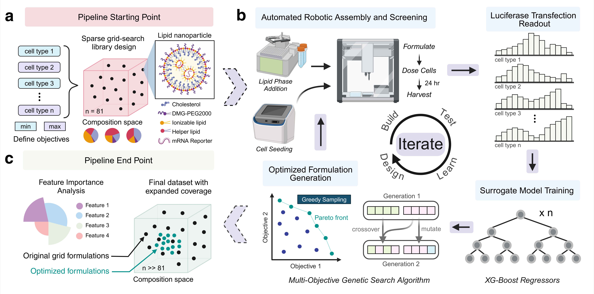

# falcon-lnp-optimization
Repository for the paper "FALCON: A Machine Learning-Driven Platform for Multi-Objective Optimization of mRNA Lipid Nanoparticle Composition Towards Cell Type-Selective Transfection"

## 🦅 What is FALCON?

**FALCON** (_**F**ramework for **A**ctive-**L**earning driven **C**ompositional **O**ptimization of **N**anoparticles_) is a closed-loop experimental-computational pipeline developed by the [Hai-Quan Mao Lab](https://maogroup.jhu.edu/) for intelligent and accelerated design of cell type-selective lipid nanoparticle (LNP) formulations.  

####   Key Capabilities:

- **Multi-objective optimization.** Learns to simultaneously *maximize* delivery to desired cell types while *minimizing* off-target effects, improving the efficacy and safety profile of LNPs.

- **Data-efficient formulation design.** Requires only a _sparse initial dataset_ to begin optimization and can rapidly identify informative candidates to test via active learning, reducing experimental burden.

- **Exhaustive and rational search.** Surrogate model-guided search algorithms test _hundreds of thousands_ of candidates in silico, outperform brute-force grid search in experiments, and enable interpretability of cell type-selective design principles.
  
- **Modular and flexible architecture**. Supports different cell types, input parameters, and optimization goals.

- **End-to-end integration.** FALCON processes input dataset and outputs formatted formulation tables compatible with automated liquid handlers (e.g., MANTIS)
  

<strong>Figure 1. Schematic Overview of Full FALCON Workflow</strong>


  
## 📁 Repository Overview

This repository contains all code, data, and scripts needed to reproduce the FALCON pipeline, including model training, optimization, visualization, and analysis.
- All experimentally obtained source data used in the manuscript are available in `source_data/`.
- Model outputs and derived plots (e.g., optimization trajectories, SHAP results, PCA) are fully reproducible using the code and scripts provided in this repository.


**Directory Structure**

```bash
falcon-lnp-optimization/
├── run_FALCON.py                       # Top-level script to launch full pipeline
├── falcon_engine/                      # Core code modules (cross validation, model selection, optimization, formatting, etc.) 
├── notebooks/                          # Interactive Jupyter notebooks for plotting 
│   ├── plot_model_performance.ipynb       
│   ├── plot_optimization_search.ipynb    
│   ├── plot_PCA.ipynb                     
│   └── plot_SHAP_analysis.ipynb          
├── output/                             # Auto-generated suggestions, trained models, plots, logs
│   ├── demo/                             # Example output of a demo run 
├── datasets/                           # Input dataset directory
├── exp_templates/                      # Template formulation sheets and destination for formatted LNP suggestions
└── environment.yml                     # Conda environment file specifying required dependencies
```


## ⚙️ Environment Setup  

We recommend using **Anaconda** to create a clean, reproducible environment that supports both Python and R.

Clone this repo and run:

```bash
conda env create -f environment.yml
conda activate falcon-env

```

<details> <summary><strong> First time setting up a coding environment?</strong> (Click to expand)</summary>

1. **Install [Anaconda](https://www.anaconda.com/products/distribution)**  
   This includes **Python**, **Conda**, and **Jupyter Notebook** — everything you need to run this project.

2. _(Optional but recommended)_ **Install [Visual Studio Code (VS Code)](https://code.visualstudio.com/)**  
   A lightweight, user-friendly code editor that works well with Conda and Jupyter.

3. Once installed, open:
   - **Anaconda Prompt** (on Windows), or  
   - **Terminal** (on macOS/Linux)

4. Then follow the environment setup instructions above to create and activate the environment.

> 💡 You do *not* need to install Python separately — Anaconda handles that for you.

</details> 

## 🧪 Running FALCON

The `run_FALCON.py` script executes the full computational pipeline:

- **Part 1 – Surrogate Model Training**:  
  Trains XGBoost models to predict LNP transfection for each specified cell type.

- **Part 2 – Optimization**:  
  Applies ML-guided search (e.g., NSGA-II, Bayesian Optimization, Dual Annealing) to identify optimal LNP compositions.

- **Part 3 – (Optional) MANTIS Formatting**:  
  Formats selected LNPs into a template compatible with robotic pipetting (e.g., MANTIS).

> 💡 Each part of the pipeline can be run independently using flags inside the script (`run_model`, `run_optimization`, `run_mantis_formatter`).

Before running, ensure:
- Your dataset (`.csv`) is correctly formatted and placed in the `datasets/` folder.
- Key script parameters are correct set:
  - `DATASET_NAME`: name of your dataset file
  - `RUN_NAME`: name of output folder
  - `input_param_names`: list of features used for model training
  - `MAX_cell_targets`, `MIN_cell_targets`: target cell types for optimization

### ▶️ To Run

Make sure you are in the project **root directory** (`falcon-lnp-optimization/`), then run:

```bash
python run_FALCON.py
```

### 📊 Interactive Analysis (Optional)

Notebooks in the [`notebooks/`](notebooks/) directory are provided as interactive plots to visualize model performance and optimization behavior:

- [SHAP feature importance](notebooks/plot_SHAP_analysis.ipynb)
- [PCA of formulation space](notebooks/plot_PCA.ipynb)
- [Pareto front and convex hull](notebooks/plot_optimization_search.ipynb)
- [Validation curves and learning diagnostics](notebooks/plot_model_performance.ipynb)

## 🧭 Features Coming Soon

We're actively expanding the FALCON framework with new capabilities to enhance its capabilities and performance:

- 🧬 **Integration of structural features** (e.g., lipid molecular descriptors)
- 🧠 **Multi-task and fine-tuned model architectures**
- 🧪 **Feasibility-aware optimization** (e.g., manufacturability as additional objectives)
- 📈 **Advanced sampling strategies**  
  - NSGA-III  
  - I-optimal design  
  - Batch optimization

